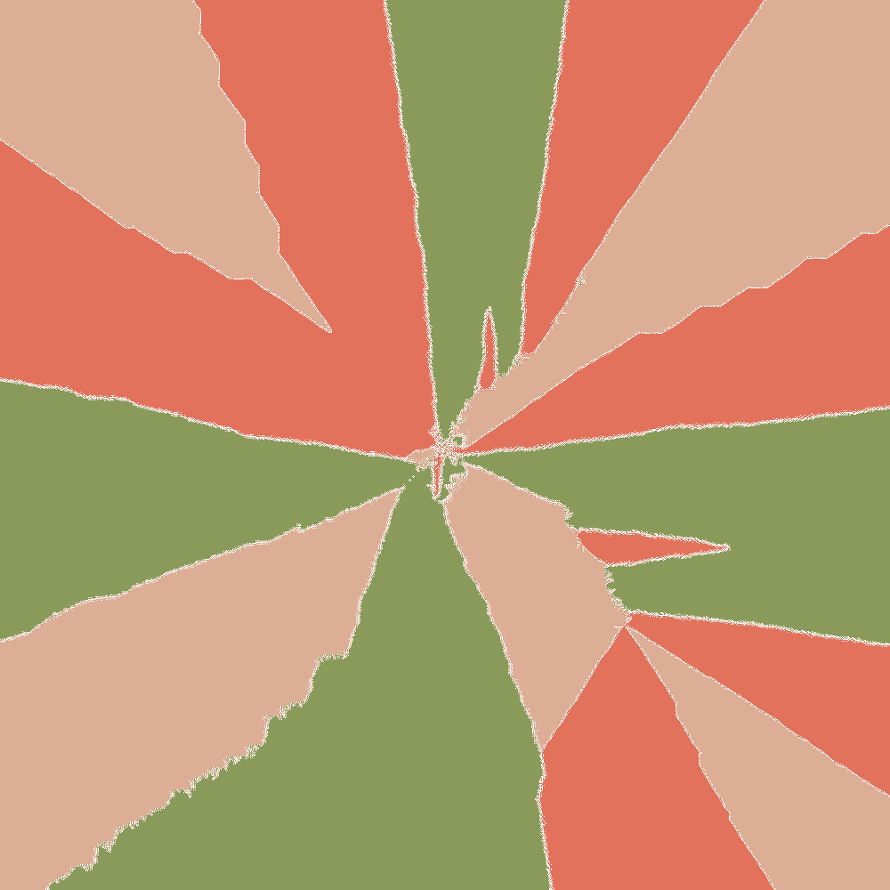

# Chessboard Sequences Simulation

Welcome to the **Chessboard Sequences Simulation**, a high-performance Python engine for simulating mathematical piece-placement games on arbitrary chessboard layouts (scaling seamlessly up to 10,000 x 10,000 grids and beyond). 

This repository was motivated by the recent Numberphile video 'Red & Black Knights': https://www.youtube.com/watch?v=UiX4CFIiegM

I wrote the code because I found the patterns very intriguing and I wanted to generate my own patterns. 
This project is a mixture of math, art, and chess. 
I invite everyone to try generate some **beautiful** patterns of their own.

The code in this repo was written with the aid of agentic tools (Antigravity). If you find any bugs, or have any features or suggested improvements, please contact Luigi Ranno.


With no effort, you can also generate mesmerizing patterns like the following, which is caused by the battle of Knight vs Stag + King vs Ferz + Wazir:



## 🎲 The Game Rules

This project simulates a mathematical placement game played by two or more players on an $N \times N$ chessboard. The rules are simple but lead to immensely complex and beautiful emergent patterns:

1. **The Sequence**: Every square on the board is numbered sequentially (e.g., from 1 to $N^2$). This defines a strict priority order for placing pieces.
2. **The Turn**: On their turn, a player must place their piece on the **lowest available numbered square**.
3. **The Conflict**: A square is considered "available" only if it is empty AND **not attacked by any opponent's piece**.
   - **Single-Player Mode**: If only 1 player is configured, they play a *self-avoiding* game—they can only place a piece on a square that is **not attacked by their own previously placed pieces**.
4. **The Players**: Each player is assigned a specific color and a rotating sequence of pieces. For example, a player could have `['Knight', 'Bishop']`, placing a Knight on their first turn, a Bishop on their second, a Knight on their third, etc.
5. **The End**: A player who has no legal moves left simply skips their turn. The simulation ends when *no player* has any legal moves remaining.
6. **The Interactions**: While leapers do not care of what new pieces are added, 'sliders' (e.g. rooks, queens, etc.) can have their vision blocked by pieces. This can lead to some interesting behaviours where a square that was not accessible to a player before, becomes accessible after the vision of a piece gets blocked. This interaction can lead to some very interesting patterns.

Because pieces control different patterns of squares (often reaching across the entire board), their interactions dictate which squares remain available, generating beautiful emergent art.

## 🎨 Creating Artistic Patterns

You can control exactly how the simulation runs and looks by editing the `main()` function in `game.py`.

### Visual Settings
Inside `game.py`, you can tweak the following boolean options to customize the output:
- `ANIMATE`: Generates a step-by-step GIF showing the board filling up turn-by-turn. *(Recommended for small boards only, $N \le 30$)*
- `SHOW_NUMBERS`: Overlays the sequence number on each square.
- `SHOW_LABELS`: Overlays a 2-letter abbreviation of the piece placed on that square.
- `PIXEL_MODE`: Generates a massive, high-resolution PNG where 1 square = 1 pixel. This bypasses `matplotlib` entirely and allows you to render $10,000 \times 10,000$ boards instantly.

### Board Sequences
The pattern heavily depends on the order in which squares are evaluated. In `game.py`, try changing `generate_inverted_spiral(N)` to one of the following imported from `generate_chessboards.py`:
- `generate_spiral(N)`: Archimedean spiral starting from the center.
- `generate_inverted_spiral(N)`: Archimedean spiral starting from the outside edge.
- `generate_raster(N)`: Standard left-to-right, top-to-bottom reading order.
- `generate_snake(N)`: Left-to-right, then right-to-left continuous snake pattern.

### Suggested Combinations
To get started generating art, try these combinations in `game.py`:

- **The Classic Cross**: `Rook` vs `Rook` on an Inverted Spiral. Sliders lock the board down incredibly fast, leaving stark, minimal geometric lines.
- **Fractal Leapers**: `Knight` vs `Knight` on a Spiral board. Leapers create beautiful, dense, woven carpet patterns.
- **The Asymmetric War**: Player 1: `['Dragon']` (very powerful) vs Player 2: `['Knight', 'Camel', 'Zebra']` (multiple weak leapers).
- **Solo Explorer**: A 1-player game with `['Queen', 'Knight']` on a Raster board.

Check out the **`examples/`** folder in this repository to see some of the stunning high-resolution art that can be generated!

## 🚀 Extreme Performance

Simulating these rules naively becomes computationally impossible very quickly. A standard $8 \times 8$ chess game has 64 squares; this engine is built to simulate $10,000 \times 10,000$ boards with 100 million squares. 

To achieve this, the engine employs extreme optimizations:
- **Numba JIT-Compilation**: The core simulation kernel is written in Python but compiled Just-In-Time to native C-speed machine code, resulting in near-zero Python overhead during the millions of game turns.
- **$O(1)$ Amortized Search**: Instead of scanning the entire board every turn, each player maintains a cursor in a pre-sorted array of squares. Finding the next move is mathematically $O(1)$.
- **Incremental Control Maps & Ray-Blocking**: Instead of re-calculating piece attacks every turn, the engine uses 3D NumPy arrays to map "control pressure." It dynamically truncates the rays of sliding pieces (like Rooks and Queens) when new pieces are placed in their line of sight, dynamically recalculating previously controlled squares.
- **Direct-to-Pixel Rendering**: Matplotlib crashes trying to plot 100 million squares. The `PIXEL_MODE` bypasses standard rendering entirely, writing raw NumPy memory arrays directly to a high-res PNG (where 1 square = 1 pixel).

## ♟️ Supported Pieces

The engine natively supports both standard chess pieces and a vast array of Fairy Chess pieces. To learn more about Fairy Chess, please get started with https://en.wikipedia.org/wiki/Fairy_chess. 

To see exactly how any piece moves and attacks, check the **`piece_moves/`** directory! You can generate these diagrams yourself by running `python generate_piece_moves.py`.

The list of Fairy Chess pieces is very long (https://en.wikipedia.org/wiki/List_of_fairy_chess_pieces), if you are intrigued by certain pieces feel free to implement, or contact me and I will try implementing it. 

Currently, the following pieces are implemented:

### Leapers (Fixed-distance jumpers)
Leapers jump directly to a target square, ignoring any pieces in between. 
- **Wazir**: (0, 1) jumper (orthogonal adjacent)
- **Ferz**: (1, 1) jumper (diagonal adjacent)
- **Dabbaba**: (0, 2) jumper
- **Knight**: (1, 2) jumper
- **Alfil**: (2, 2) jumper
- **Threeleaper**: (0, 3) jumper
- **Camel**: (1, 3) jumper
- **Zebra**: (2, 3) jumper
- **Tripper**: (3, 3) jumper
- **Fourleaper**: (0, 4) jumper
- **Giraffe**: (1, 4) jumper
- **Stag**: (2, 4) jumper
- **Antelope**: (3, 4) jumper
- **Custom Leaper**: You can instantly create any jumper by adding `'leaper_X_Y'` to your piece list!

### Sliders (Ray-casting pieces)
Sliders move continuously in a straight line until they hit the edge of the board or another piece.
- **Rook**: Orthogonal slider
- **Bishop**: Diagonal slider
- **Queen**: Orthogonal + Diagonal slider
- **Dragon**: Queen + Knight
- **Amazon**: Queen + Knight (synonym for Dragon)
- **Empress**: Rook + Knight
- **Chancellor**: Rook + Knight (synonym for Empress)
- **Princess**: Bishop + Knight
- **Archbishop**: Bishop + Knight (synonym for Princess)

## 📁 Repository Structure

- `game.py`: The core simulation engine. This is where you configure your game, player colors, piece lists, and board sizes. Run this script to execute a simulation!
- `generate_chessboards.py`: Contains algorithms for numbering the chessboard. Supported sequences include `Raster`, `Continuous Snake`, `Archimedean Spiral`, and `Inverted Spiral`.
- `generate_piece_moves.py`: A utility script to generate visual diagrams of how every piece attacks.
- `verify.py` & `verify_sliders.py`: A rigorous test suite containing a slow but provably correct pure-Python reference implementation. These scripts verify that the ultra-fast Numba engine computes exactly the same board states, guaranteeing correctness.

## 🛠️ How to Run

1. **Install Dependencies**
Ensure you have the required libraries installed:
```bash
pip install numpy matplotlib pillow numba
```

2. **Configure Your Game**
Open `game.py` and modify the `main()` function. You can set the board size `N` and customize the `players` list. Add as many players as you want!

```python
# game.py
N = 1000 # Try 10 for animations, 1000 for quick tests, 10000 for extreme scale

# Set the options you want. Suggest 'ANIMATE', 'SHOW_NUMBERS' and 'SHOW_LABELS' to True and PIXEL_MODE to False when you are trying to debug or see how patterns form (use small boards).
# Otherwise, keep these settings to generate large images 
# --- Options ---
ANIMATE = False          # Generate step-by-step GIF (small boards only)
SHOW_NUMBERS = False     # Draw sequence numbers on squares
SHOW_LABELS = False      # Draw piece abbreviations on placed squares
PIXEL_MODE = True       # Also save high-res 1px-per-square image

# Then, set the players and their pieces
# Use standard web colors, hex codes, or RGB tuples
players = [
    {'color': '#E2725B', 'pieces': ['Knight', 'Camel']}, # Player 1 (Reddish)
    {'color': '#8A9A5B', 'pieces': ['Stag', 'King']},    # Player 2 (Greenish)
]
```

3. **Run the Simulation**
```bash
python game.py
```

Depending on your settings in `game.py` (e.g. `PIXEL_MODE`, `ANIMATE`), the engine will automatically generate and save output images or GIFs to the `visualizations/` folder.

4. **Explore Piece Moves**
If you want to see exactly how a "Zebra" or an "Empress" moves, you can generate visualizations for all pieces:
```bash
python generate_piece_moves.py
```
This will populate the `piece_moves/` folder with helpful diagrams showing the piece placed in the center of an empty board.
The piece moves of all the supported pieces are already available in the folder. If you implement anything new and want to check, feel free to use generate_piece_moves.py to check the implementation is correct.
